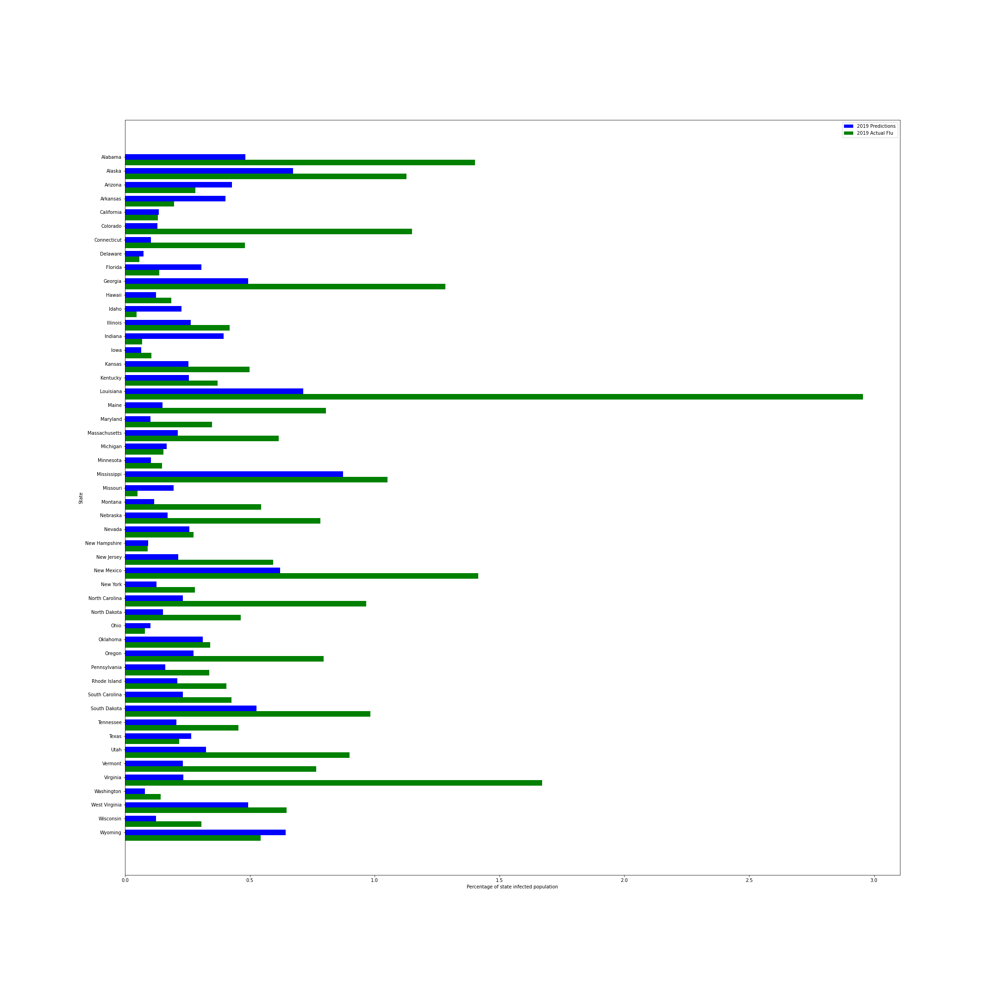

# Let's Go Viral 

## Summary

When taking a looking at viral concentration, could areas be better prepared for a flu season or outbreak knowing where their population sat in regards to probable infections therefor, slowing the spread and having preventative and treatment protocol in place. By taking a look at past flue cases, can an area's case percentage be predicted when considering social metrics such as population density, gross domestic product (GDP), per capita income (PCI), and medically uninsured rates.

This analysis was completed by using 50 states flu cases data and their percentages to population; then creating a machine learning model to examine if there is a correlation to the four selected social factors and what the predictability outcome would be. The model will generate predictions to show viral concentrations.

The **Let's Go Viral** team:
Matt Kaufmann, Ryan Lindsey, Jessica Dafler, Patrick Ekanga

**Presentation and Dashboard**

Presentation: [Prezi Let's Go Viral](https://lindsera1.github.io/GoingViral/Lets_Go_Viral_Site/)

Topic: Using 2016-2019 flu data, can we model a relationship between viral concentration and the four factors of GDP, PCI,
uninsured rates, and population density in all 50 states.

Why we chose it? We chose this topic because we wanted to take a deeper look at the relationship between social 
opportunity and public health, and create a tool that could help our healthcare officials and administrators target the 
areas that could use the most care, thus better help the entire population. 

## Data Exploration

### Flu Data

+ Data for flu cases for years 2016 - 2019 for all 50 states:

Interactive application: [Flu Data](https://gis.cdc.gov/grasp/fluview/fluportaldashboard.html)

### Socioeconomic metrics

+  GDP - The files containing GDP by state states and county for years 2016 - 2019 were cleaned with python in pandas to be properly categorized for doing later in the analysis. Data source: [GDP Data](https://apps.bea.gov/regional/downloadzip.cfm)

+ PCI -  The files used for PCI were sourced for years 2016 - 2019 were cleaned and merged with python in pandas to create the final data frame for all states.  Data source: [PCI Data](https://fred.stlouisfed.org/release?rid=110)

+ Population Density - The CSV files for both total square mileage per county, as well as population in CSV files, and will need some further ETL to convert to population density per county. In case we decide to scale up, I have also included the same information on a statewide scale.

+ Uninsured Status - For uninsured percentages by state, the CSV files for health coverage status and type of coverage measured by state. Data Source: [Uninsured Data](https://www.census.gov/library/publications/2020/demo/p60-271.html)

**Data Analysis**

Primary use of data analysis resulted from a developed Random Forest Regressor machine learning model with a MSE of .21.

[Random Forest Regressor]("RM_ML_Viz.ipynb")

Random Forest Regressor Machine Learning model was used to test and train 2016 - 2018 data and make a prediction for 2019. With the predictions, the visualization created showed the predictions from the RFR versus the actual data from 2019 (with a MSE of .37). 

[2019 Predictions from Random Forest Regressor ML Model]("pred_rfr_2019.ipynb")

**Technologies**

The following various technologies will be used throughout the completion of this project:

+ Data Exploration/ETL: Pandas in Python
+ Database: PostgreSQL, AWS, Heroku, DBeaver
+ Machine Learning: Random Forest Regression SKLearn Library
+ Visualization: Prezi, Matplotlib, Javascript (Leaflet.js)

## Presentation Link

[Presentation](https://lindsera1.github.io/GoingViral/Lets_Go_Viral_Site)

## Machine Learning Model

+ Data Preprocessing: Much of the data we used we're already in CSV or XLSX format. Matt did convert flu cases to percentages 
of each state, and I converted population into population density by dividing the population by the square mileage landmass.
After that was done, we saved our data as CSV.

+ Feature engineering: The initial data was very specific, and very little dimensionality reduction was performed. The 
uninsured rate data had to be extracted from a larger data set of other variables.

+ Training/Testing Split: The data was trained on 2016 to 2018 data, and tested against 2019 data to see the predictive 
accuracy.

+ Model Choice: upon trying a few different models, including a simple linear regression and a multiple linear regresssion, 
we decided to look into random forest regression, and fortunately we found that we were able to extract greater insight
from this model, with an RMSE value of .45

+ Changes in model choice: We tried linear regression initially because our team believed that we could find easy negative 
or positive correlation between these variables, but that turned out to not work as well as we planned. We found that our 
data was not linear at all, and so we needed a model that could look at the deeper relationships between our four variables.
Random Forest seemed to be our best choice because we didn't have neough variables for deep learning, and we did have a 
relatively smaller sample size.

+ How we have trained the model: We've combined data from 2016 to 2018 in order to set our model up to predict 2019 data, and 
compare the 2019 predictions against the 2019 true values. 

+ Describe current accuracy scores: As of now, we have an accuracy score of .45 RMSE, which is satisfactory. Currently we are
tweaking some parameters, such as sample size, and n-estimators on a newer model to see if we get better performance. 

