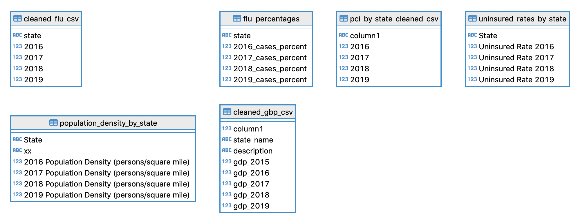

# Let's Go Viral 

## Summary

When taking a looking at viral concentration, could areas be better prepared for a flu season or outbreak knowing where their population sat in regards to probable infections therefor, slowing the spread and having preventative and treatment protocol in place. By taking a look at past flue cases, can an area's case percentage be predicted when considering social metrics such as population density, gross domestic product (GDP), per capita income (PCI), and medically uninsured rates.

This analysis was completed by using 50 states flu cases data and their percentages to population; then creating a machine learning model to examine if there is a correlation to the four selected social factors and what the predictability outcome would be. The model will generate predictions to show viral concentrations.

The **Let's Go Viral** team:
Matt Kaufmann, Ryan Lindsey, Jessica Dafler, Patrick Ekanga

## Data Exploration

### Flu Data

+ Data for flu cases for years 2016 - 2019 for all 50 states:

Interactive application: [Flu Data](https://gis.cdc.gov/grasp/fluview/fluportaldashboard.html)

### Socioeconomic metrics

+  GDP - The files containing GDP by state states and county for years 2016 - 2019 were cleaned with python in pandas to be properly categorized for doing later in the analysis. Data source: [GDP Data](https://apps.bea.gov/regional/downloadzip.cfm)

+ PCI -  The files used for PCI were sourced for years 2016 - 2019 were cleaned and merged with python in pandas to create the final data frame for all states.  Data source: [PCI Data](https://fred.stlouisfed.org/release?rid=110)

+ Population Density - The CSV files for both total square mileage per county, as well as population in CSV files, and will need some further ETL to convert to population density per county. In case we decide to scale up, I have also included the same information on a statewide scale.

+ Uninsured Status - For uninsured percentages by state, the CSV files for health coverage status and type of coverage measured by state. Data Source: [Uninsured Data](https://www.census.gov/library/publications/2020/demo/p60-271.html)

## Technologies

The following various technologies will be used throughout the completion of this project:

+Data Exploration/ETL: Pandas in Python
+Database: PostgreSQL, AWS, Heroku, DBeaver
+Machine Learning: Random Forest Regression SKLearn Library
+Visualization: Prezi, Matplotlib, Javascript (Leaflet.js)

**Databases ERD**

  

**Data Analysis**

Primary use of data analysis resulted from a developed Random Forest Regressor machine learning model with a MSE of .21.

[Random Forest Classifier](https://github.com/lindsera1/GoingViral/blob/main/RM_ML_Viz.ipynb)

**Data Visualization**

Presentation: [Prezi Let's Go Viral](https://prezi.com/view/wcYeHPzKQQVd38lteoqp/)

## Communication

+Slack
+Trello: [Let's Go Viral Trello Board](https://trello.com/b/3U1mTA7q/project-board-use-this-one)
+Zoom
